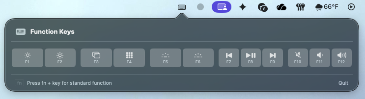

# Fn Keyboard



A lightweight macOS menu-bar utility that puts the Mac function keys (F1–F12) at your fingertips. Click an on-screen keycap and the real system action fires — brightness, media controls, volume, and more.


## Features

- **Menu-bar only** — lives in the status bar with a keyboard icon, no Dock clutter
- **Beautiful popover** — all 12 function keys grouped like a real Mac keyboard
- **SF Symbols** — each key shows the matching system icon and label
- **Animations** — hover highlight and spring-press feedback
- **Dark / Light mode** — colors automatically adapt to your system appearance
- **Real key simulation** — tapping a keycap triggers the actual system function via HID / CGEvent
- **Physical key monitoring** — detects which F-keys are physically held down (requires Accessibility permission)

## Requirements

| Requirement | Minimum |
|---|---|
| macOS | 13.0 Ventura |
| Xcode CLI Tools | `xcode-select --install` |

## Quick Start

```bash
git clone https://github.com/<your-username>/FnKeyboard.git
cd FnKeyboard
chmod +x build.sh
./build.sh
open build/FnKeyboard.app
```

### Create a distributable DMG

```bash
./build.sh --dmg
# → build/FnKeyboard.dmg
```

## Permissions

On first launch, macOS will prompt you for **Input Monitoring** (Accessibility).
This is required so the app can detect physical key presses and simulate system actions.

> **System Settings → Privacy & Security → Input Monitoring** — enable **FnKeyboard**.

## Project Structure

```
FnKeyboard/
├── Sources/
│   ├── FnKeyboardApp.swift        # @main entry — NSStatusItem + NSPopover
│   ├── FunctionKey.swift           # Data model & static key definitions
│   ├── FunctionKeyView.swift       # Individual keycap SwiftUI component
│   ├── KeyboardView.swift          # Main popover layout (header, keys, footer)
│   ├── KeyPressMonitor.swift       # CGEvent tap for physical key detection
│   └── KeySimulator.swift          # HID / CGEvent key simulation
├── Assets.xcassets/                # App icon asset catalog
├── Info.plist                      # App metadata (LSUIElement = true)
├── Package.swift                   # Swift Package Manager manifest
├── build.sh                        # One-step build + optional DMG
├── generate_icon.swift             # Standalone script to generate AppIcon.icns
└── LICENSE
```

## Usage

| Action | How |
|---|---|
| Open | Click the ⌨️ icon in the menu bar |
| Trigger a key | Click any keycap in the popover |
| Dismiss | Click anywhere outside the popover |
| Quit | Click the ⌨️ icon → **Quit** button |

## Contributing

1. Fork the repo
2. Create a feature branch (`git checkout -b feature/my-idea`)
3. Commit your changes (`git commit -m "Add my idea"`)
4. Push to the branch (`git push origin feature/my-idea`)
5. Open a Pull Request

## License

[MIT](LICENSE)
